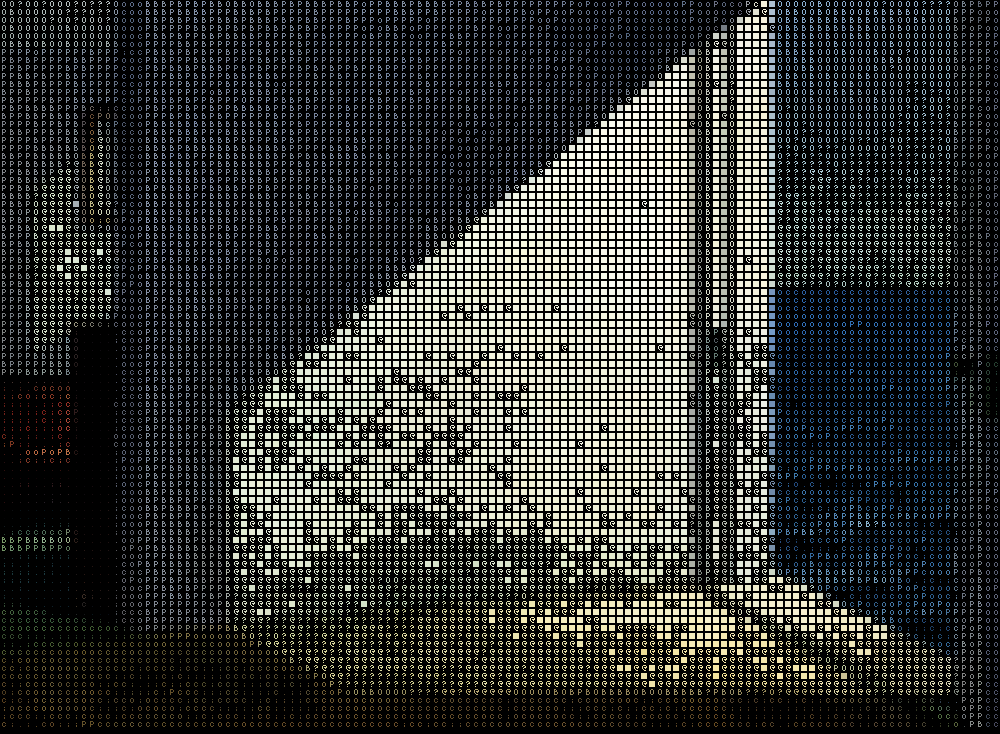
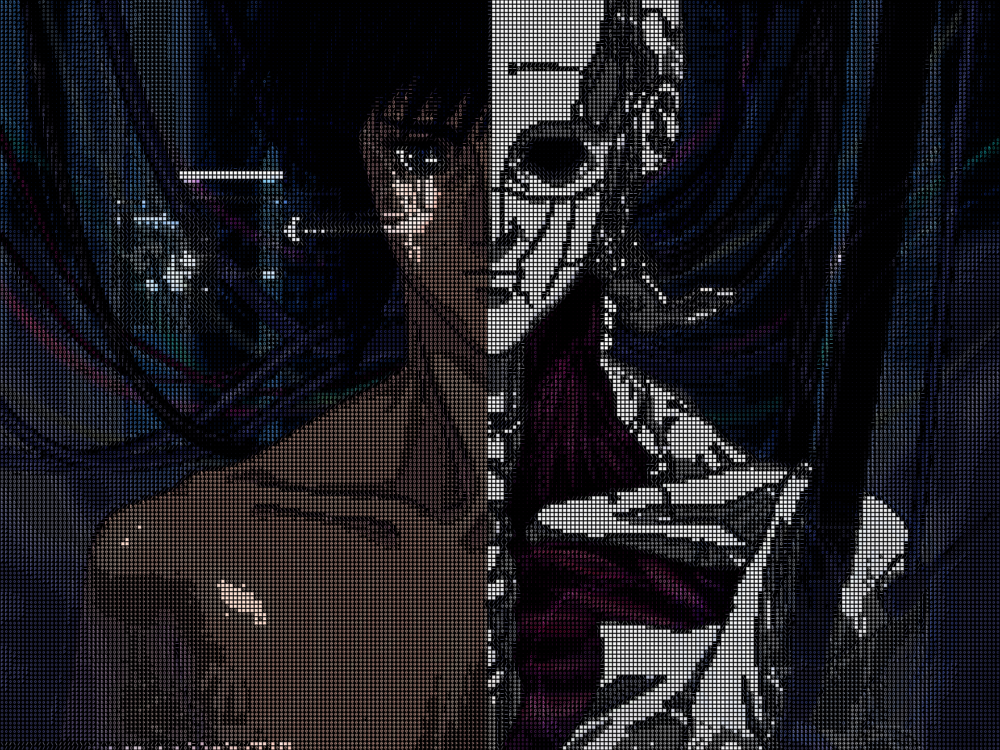
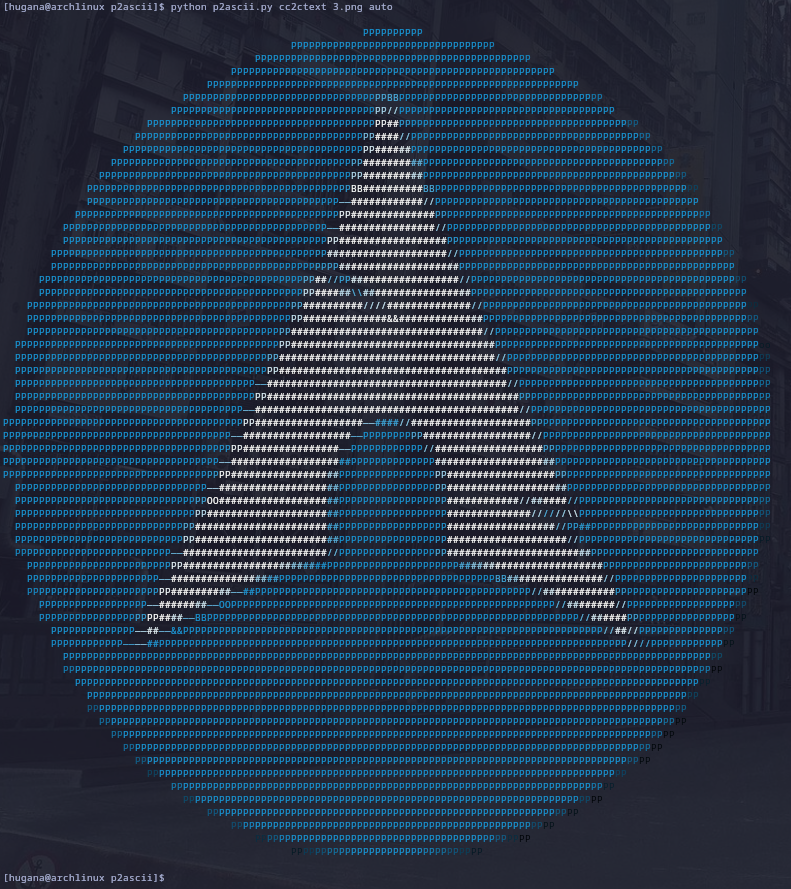

# p2ascii

**p2ascii** is a Python-based tool that converts images into ASCII art. It supports:

- **Simple mode**: brightness-based mapping of pixels to ASCII characters.
- **Complex mode**: edge-aware rendering using **Sobel gradients** to compute orientation and magnitude.

It can output:
- ASCII **text**, optionally with ANSI color codes.
- ASCII **images**, where characters are rendered as image blocks.

**Note:** The output that is produced is the same dimension has the original both in image and in text. So using it in text keep in mind small images are better. 

---

## Features

- Sobel-based edge detection for orientation-aware rendering.
- Optional color support for both text and image modes.
- Configurable edge sensitivity (`<thresh>`).
- Terminal or image file output.
- Simple and complex conversion modes.

---

## Requirements

- Python 3.7+
- [`opencv-python`](https://pypi.org/project/opencv-python/)
- [`numpy`](https://pypi.org/project/numpy/)

## Usage

### 🔹 Simple Conversion (No Edge Detection)

  - `sc2image `         Convert image to ASCII image
  - `sc2text `          Convert image to ASCII text (stdout)
  - `sc2cimage `        Colored ASCII image
  - `sc2ctext `         Colored ASCII text (stdout)

### 🔸 Complex Conversion (With Edge Detection)

  - `cc2image  <thresh>`     ASCII image using edge orientation
  - `cc2text  <thresh>`      ASCII text with edge symbols (stdout)
  - `cc2cimage  <thresh>`    Colored ASCII image with edge awareness
  - `cc2ctext  <thresh>`     Colored ASCII text with edge symbols

## Threshold Parameter (<thresh>)

Used in complex conversion to control edge sensitivity based on gradient magnitude.
  - auto: Automatically computes threshold as the 90th percentile of non-zero magnitudes:
  - 0–255: Manual threshold.
    - Higher = fewer edges (only strong ones)
    - Lower = more edges (fine details)
   
## Example Outputs

### Simple ASCII Image

### Complex ASCII Image (Edge Detection)

### Colored ASCII Text (Edge Detection)

## Motivation 

Motivation

My motivation for this project stems from a captivating video by Acerola, which you can find here: https://www.youtube.com/watch?v=gg40RWiaHRY. Inspired by their work, I wanted to challenge and test my skills in computer vision.
